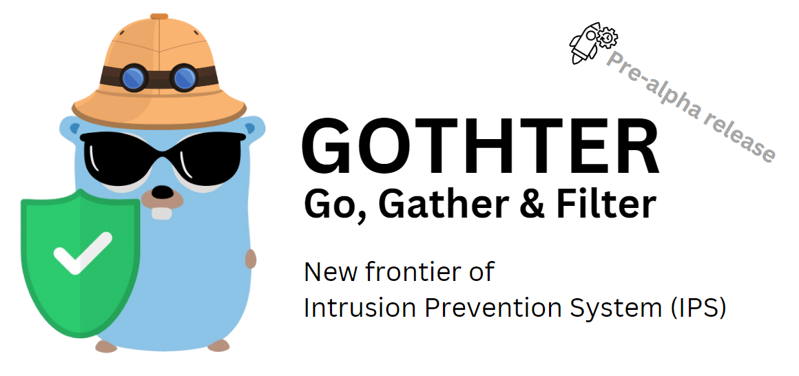
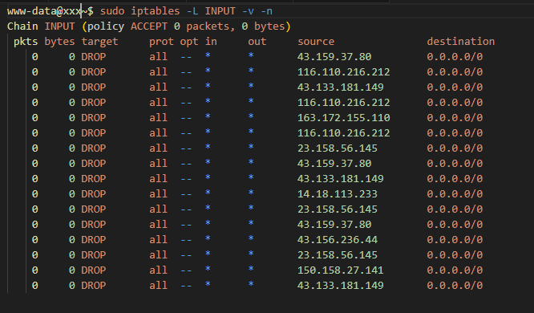

# Gothter

## Overview

**Gothter** is a modern, lightweight security monitoring tool designed to enhance the safety of your systems by scanning and analyzing log files for suspicious activities.
Built with Go, Gothter provides robust and efficient log monitoring capabilities, integrating seamlessly with your existing infrastructure.



## Features
- **Log Scanning:** Monitors system and application logs, for security threats, currently only checking against auth.log
- **Notifications:** Sends real-time notifications via email or Slack when potential threats are detected.
- **Efficient Processing:** Utilizes Go's concurrency features to process large volumes of log data efficiently.
- **Configurable:** Easily configurable through a YAML file to fit various monitoring needs and environments.

## Coming Soon
I am actively working on the following features to enhance Gothter's capabilities:
- **Customizable Modular Patterns:** Define custom patterns to detect specific types of suspicious activities and anomalies.
- **Build systemd Service:** Integration with systemd for seamless service management and automatic startup.
- **Slack Notifications:** Improved notification system with support for Slack integration.
- **Docker Log Support:** Enhanced functionality to monitor and analyze logs from Docker containers.
- **GUI Support:** GUI to monitor operations and activities
- **State Management:** State management using database
- **Improved Log Parsing:** Enhanced capabilities to efficiently parse and analyze large log files greater than 1GB.

## Getting Started

To get started with Gothter, follow these steps:

1. **Clone the Repository:**
   ```bash
   git clone https://github.com/bsalim/go-gothter.git
   cd go-gothter
   ```


2. **Install Go lang**
   Follow instruction on Go lang website to install go

3. **Install Dependencies:**
   ```bash
   go mod tidy
   ```

4. **Configure the application:**

Edit the configs/default_config.yaml file to set paths to your log files, define patterns to detect, and configure notification settings.

5. **Build the project and run it**
  ```bash
   go build -o gothter ./cmd/main.go
   
   # Run using sudo since auth.log is a system file log
   sudo ./gothter
   ```

6. **Monitor log:**
Gothter will start monitoring your logs according to the configuration and send notifications when suspicious activity is detected.

```bash
# Check Gothther logs and activities
sudo tail -f /var/log/gothter.log
```


7. **Check Blocked IPs:**
You can checked number of IPs blocked by issuing following command:

```bash
# Check Gothther logs and activities
sudo iptables -L INPUT -v -n
```




## License
Gothter is licensed under the GNU General Public License v3.0. See the [LICENSE](LICENSE) file for more information.